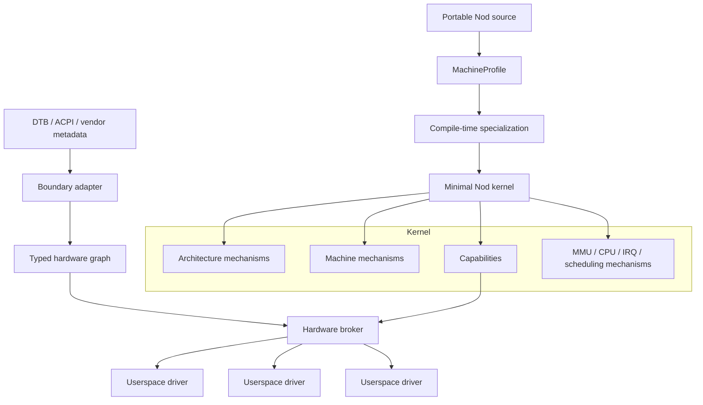

# 27 — Architecture and HAL

## Status

Active architecture area.

This file is the working entry point for Nod's architecture/HAL research. It records the current direction and the research gates that must be completed before a permanent project rule is written.

Initial research baseline:

- `tmp/research/00-architecture-and-hal-research.md`

Research roadmap:

- `tmp/research/hal-research-roadmap.md`

---

## Purpose

Define how Nod separates CPU architecture, machine-specific integration, hardware discovery, typed hardware resources, hardware authority, and userspace drivers without introducing a lowest-common-denominator HAL.

The design must support:

- aggressive machine specialization,
- future portability across desktops, servers, SBCs, phones, and heterogeneous SoCs,
- a small trusted computing base,
- capability-based hardware authority,
- userspace drivers where practical,
- native asynchronous/completion-driven execution,
- message passing for control,
- high-performance direct data paths.

---

## Current Architecture Direction



---

## Stable Direction

The working architecture assumes the following unless later evidence disproves them:

- no traditional generic device HAL inside the kernel,
- explicit separation of architecture, machine, and device,
- hardware-description formats remain at compatibility boundaries,
- typed native hardware facts inside Nod,
- capability-based authority over MMIO, IRQ, DMA, reset, clock, and related resources,
- userspace drivers by default,
- direct mapped MMIO after authorization,
- CPU/cache/NUMA/power topology as first-class data,
- compile-time specialization before boot-time specialization,
- boot-time specialization before runtime dispatch,
- messages for control and ownership,
- mapped buffers/rings/DMA/completion queues for data,
- driver isolation policy separate from the logical driver interface,
- safe Rust after small audited unsafe hardware boundaries,
- SMP kernel initially, without unnecessary global shared-state bottlenecks.

---

## Architectural Boundaries

### `arch`

Owns ISA-defined mechanisms.

Must not know machine brands or ordinary devices.

### `machine`

Owns only what the kernel needs to function on a concrete machine family.

Must not absorb ordinary driver implementation.

### Hardware description boundary

Consumes DTB, ACPI, or vendor metadata and normalizes them once.

Must not leak external schema semantics through the rest of the system.

### Hardware graph / broker

Represents typed facts and delegates authority.

Must not become an untyped mutable global registry.

### Drivers

Consume explicit hardware capabilities.

Must not require ambient privilege.

---

## Performance Model

Every abstraction in this area must be evaluated for:

- dispatch cost,
- direct and indirect branches,
- inlining,
- instruction-cache footprint,
- data-cache locality,
- pointer chasing,
- TLB pressure,
- false sharing,
- cache-line bouncing,
- NUMA/topology effects,
- code-size growth,
- allocation behavior.

Clean API design alone is not sufficient evidence.

---

## Portability Model

Nod targets **portable source architecture with machine-specialized outputs**.

Examples:

```text
nod-qemu-aarch64
nod-rpi5
nod-apple-*
nod-qualcomm-*
```

The architecture must allow a future phone, laptop, server, or embedded target without forcing those systems through one universal hardware binary path.

Compile-time assumptions must still be validated against boot-time facts when the platform contract requires runtime discovery.

---

## First Portability Invariant

QEMU Arm `virt` and Raspberry Pi should share the same AArch64 architecture layer.

Expected shape:

```text
arch/aarch64/
machine/qemu-virt/
machine/raspberry-pi/
```

If the Raspberry Pi port requires widespread machine-specific changes inside `arch/aarch64`, the boundary is wrong and must be redesigned.

---

## Research Gates Before a Permanent Rule

The following subjects remain open and must be resolved one by one:

1. architecture dispatch cost,
2. machine-profile representation,
3. compile-time versus runtime specialization,
4. boot-time code specialization/patching,
5. hardware-graph layout and lookup model,
6. hardware capability representation and lookup cost,
7. userspace IRQ delivery latency,
8. userspace driver overhead,
9. driver co-location model,
10. per-core state layout and false sharing,
11. mapping/page-size policy for system regions,
12. topology representation and scheduling-facing API,
13. hot-plug/topology update model,
14. QEMU-to-Raspberry-Pi portability validation.

The detailed checklist lives in `tmp/research/hal-research-roadmap.md`.

---

## Exit Criteria

`27-architecture-and-hal` is ready to become a durable `.agents/rules/...` rule only when:

- every roadmap item is either completed or explicitly rejected with evidence,
- benchmark results are reproducible,
- the architecture/machine boundary is validated by at least QEMU Arm and Raspberry Pi,
- hot-path abstraction choices have measured costs,
- hardware authority is modeled without ambient privilege,
- no unresolved design requires a generic lowest-common-denominator HAL,
- permanent rules can be written as unambiguous requirements rather than preferences.
