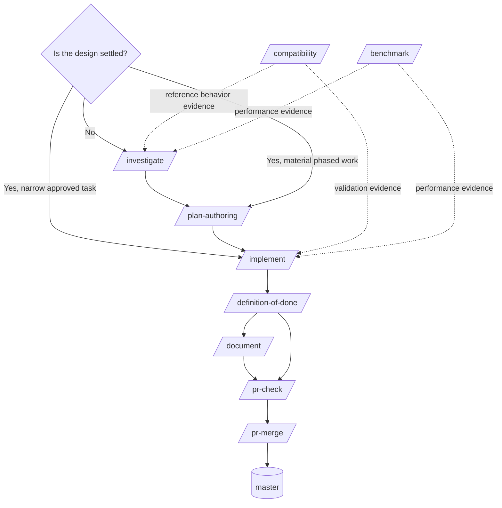
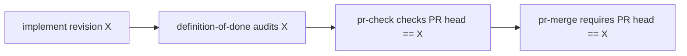

# Nod Skill Responsibility Map

## Goal

Keep each workflow decision owned by exactly one skill.



## Exclusive ownership

| Skill | Owns | Must not own |
|---|---|---|
| `investigate` | uncertainty, alternatives, evidence interpretation, design decision | production implementation, implementation sequencing |
| `plan-authoring` | executable implementation sequencing from settled decisions | research, re-deciding architecture, implementation |
| `implement` | repository changes, development validation, implementation evidence | architectural research, final completion audit |
| `benchmark` | reproducible performance measurement | architecture decision, optimization implementation unless explicitly part of the task |
| `compatibility` | reproducible reference behavior at an explicit boundary | native Nod design decisions, performance claims, production implementation |
| `definition-of-done` | audit approved task/plan against implementation evidence | producing missing evidence, running gates, implementing fixes |
| `document` | durable public documentation of validated behavior | architecture decisions, implementation, completion auditing |
| `pr-check` | branch/PR/revision integration readiness | re-reviewing implementation correctness or rerunning validation |
| `pr-merge` | authorized merge into `master` and ancestry verification | validation, roadmap semantics, release publication |
| `pr-review` | future external-contribution review only | ordinary internal Nod workflow |

## Routing rules

### Unresolved design

Use:

```text
/investigate
```

If the investigation needs a quantitative performance result, `/benchmark` produces that
measurement and `/investigate` interprets it.

If the investigation needs exact reference-system behavior, `/compatibility` produces that
evidence and `/investigate` decides what Nod should do with it.

### Settled design, material implementation

Use:

```text
/plan-authoring
    ->
/implement
    ->
/definition-of-done
```

### Settled design, small implementation

Use:

```text
/implement
    ->
/definition-of-done
```

Do not insert `/chore`.

### Durable behavior changed

Use `/document` between `/definition-of-done` and `/pr-check`.

A change that alters no durable public behavior skips it.

### Merge path

Use:

```text
/definition-of-done
    ->
/document, when durable public behavior changed
    ->
/pr-check
    ->
explicit maintainer authorization
    ->
/pr-merge
    ->
master
```

`/pr-check` reads the completion result; it does not reproduce it.

`/pr-merge` reads the readiness result; it does not reproduce it.

## Revision identity

The revision is the handoff key between the final stages.



Any push that changes `X` invalidates downstream readiness.

The new revision must pass the owning stages again.
